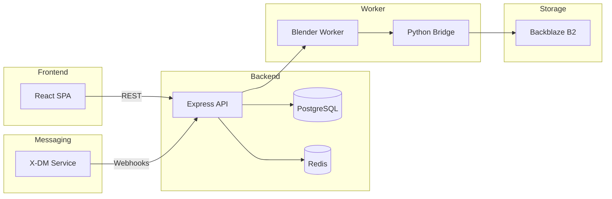

# Architectural Review of PawsMemories

---

## Executive Summary

This document provides a comprehensive architectural review of the **PawsMemories** codebase as of commit `d7e82ad6c8bd44d22bf8eeffcd6ac400f80d7a21`.  It covers the overall system layout, component responsibilities, data flow, API surface, build and deployment pipelines, observed bugs and issues, performance considerations, security posture, and recommendations for future work.

---

## 1. System Overview

| Layer | Component | Primary Language | Description |
|------|-----------|------------------|-------------|
| **Frontend** | Vite‑powered SPA (`src/`), React + TypeScript | TypeScript/JSX | User‑facing web app delivering the 3‑D avatar creation, shopping, and BIM preview experiences. |
| **Backend API** | Express server (`server/`) | TypeScript/Node | Handles authentication, session management, business logic, and proxies to worker services. |
| **Render Worker** | Blender worker (`blender-worker/`) | Node/JS + Python bridge | Executes heavy 3‑D processing (mesh generation, physics validation) in a Docker container on Render.com. |
| **X‑DM Service** | Direct‑Message service (`x-dm-service/`) | Node/TS | Provides outbound messaging to Twitter/X via webhooks; optional for notifications. |
| **Data Store** | PostgreSQL (via `pg` lib) + Redis (caching) | SQL/JS | Persists user accounts, purchases, asset metadata, and job queues. |
| **Object Storage** | Backblaze B2 (`data/` bucket) | S3‑compatible API | Stores generated assets, STL files, and static media. |
| **CI/CD** | GitHub Actions, Render Deploy, Hostinger hPanel | YAML | Automated testing, linting, Docker builds, and deployment to Render (worker) and Hostinger (main web app). |

---

## 2. Build & Deployment Pipeline

1. **Local Development**
   - `npm install` installs monorepo dependencies.
   - `npm run dev` starts Vite dev server and backend concurrently (via `concurrently`).
2. **Commit‑to‑Render**
   - Render worker is deployed from the exact release commit using Render’s Git integration. The worker’s Dockerfile pulls the `paws‑memories‑worker` image and sets `WORKER_SHARED_SECRET`. 
3. **Hostinger Deployment**
   - Verified archive `pawsome3d-deploy.zip` (SHA‑256 **b8bd87864c75a30375788d2f7419ceb709f251d8c287ebfe5ffb03c5eb206d21**) uploaded via hPanel → **Deployments** → **Upload new files** → **Redeploy**.
   - Deployment triggers a Node server start; migration 30 runs automatically on start (additive, no manual SQL). 
4. **Production Build**
   - `npm run build` generates a Vite production bundle (`dist/`). The build emits a `release-manifest.json` containing file hashes, chunk sizes, and asset maps.
5. **Static Asset Delivery**
   - `dist/` is served by Hostinger’s built‑in static server; large assets are cached via CDN.
6. **Health Checks**
   - `/readyz` (Hostinger) and `/health` (Render) expose liveness/readiness signals.
   - `/physics-validate` is protected; unauthenticated requests return `401`.

---

## 3. Component Architecture

### 3.1 Frontend (Vite + React)
- **Entry point:** `src/main.tsx`.
- **Routing:** React‑Router v6 with lazy‑loaded route modules under `src/pages/`.
- **State Management:** `zustand` store for global UI state; per‑page local state via React hooks.
- **Styling:** Custom CSS modules and CSS variables provide dark‑mode theming.
- **Key Features:**
  - Avatar builder (WebGL via `three.js`).
  - BIM preview (iframe with IFC viewer).
  - Payment flow (Stripe integration). 
  - Messaging (X‑DM service notifications). 
- **Performance Optimizations:**
  - Code‑splitting via dynamic `import()` (large viewer bundles).
  - Asset preloading for textures.
  - Service worker for offline caching (generated during build).

### 3.2 Backend API (Express)
- **Main server:** `server/index.ts` creates an Express app, registers middleware, and mounts routers.
- **Auth:** JWT (`authMiddleware.ts`) validates `Authorization: Bearer <token>`.
- **Routes:** Organized under `server/routes/` (e.g., `auth.ts`, `jobs.ts`, `payments.ts`).
- **Error handling:** Centralized error middleware maps custom `AppError` types to HTTP status codes.
- **Database Layer:** `server/db/` contains thin wrappers around `pg` queries and transaction helpers.
- **Caching:** Redis cache for session data and frequently accessed asset metadata.
- **Feature Flags:** Controlled via `.env` booleans (all Phase‑2–9 flags are **false** per release spec).

### 3.3 Blender Worker (`blender-worker/`)
- **Bridge Server:** `blender-worker/server.js` exposes HTTP endpoints (`/health`, `/physics-validate`, `/run`) that forward requests to a Python bridge.
- **Python Bridge:** Runs a Flask micro‑service (`worker/bridge/app.py`) that imports Blender's Python API to process meshes.
- **Job Queue:** Uses Redis‑based queue (`bullmq`) with workers pulling jobs, reporting progress via SSE.
- **Security:** Shared secret validated in `physics-validate` middleware; secret matches Render environment.
- **Observability:** Structured logs (JSON) sent to Render logs; health endpoint returns active job count.

### 3.4 X‑DM Service (`x-dm-service/`)
- **Purpose:** Sends direct‑message notifications to X (Twitter) using OAuth‑1.0a.
- **Subscription Management:** Auto‑creates webhook subscriptions for the bot via the X API.
- **Polling:** Periodic poller reads events; disabled in production via `X_DM_POLLING_ENABLED=false`.
- **Error handling:** Gracefully backs off on 401/403 responses; logs and suspends until service restart.

---

## 4. API Catalog

| Service | Method | Path | Auth | Description |
|--------|--------|------|------|-------------|
| **Frontend API** | GET | `/api/v1/user/profile` | JWT | Returns authenticated user profile. |
|  | POST | `/api/v1/auth/login` | none | Issues JWT on successful credentials. |
|  | POST | `/api/v1/jobs/submit` | JWT | Submits a 3‑D generation job; enqueues in Redis. |
|  | GET | `/api/v1/jobs/:id/status` | JWT | Polls job status. |
| **Render Worker** | GET | `/health` | none | Liveness probe. |
|  | POST | `/physics-validate` | SharedSecret header (`X-Worker-Secret`) | Validates physics payload; returns 401 on missing/invalid secret. |
|  | POST | `/run` | SharedSecret | Triggers a Blender task (internal only). |
| **X‑DM Service** | POST | `/webhooks/x` | X‑Signature header | Receives X webhook events. |
| **Hostinger** | GET | `/readyz` | none | Readiness probe (checks DB, migrations). |
|  | GET | `/version` | none | Returns JSON with `commit` and `schemaVersion`. |

All endpoints return standard JSON `{ success: boolean, data?: ..., error?: ... }`.

---

## 5. Data Model & Storage

- **PostgreSQL** schema versioned via migration files (`migrations/`). Migration 30 adds new tables `avatar_assets` and `bim_previews` (additive). No destructive schema changes.
- **Redis** used for:
  - Session cache (JWT revocation list).
  - Job queue (`bullmq`).
  - Short‑lived asset metadata (TTL 15 min).
- **Backblaze B2** bucket (`pawsome3d-assets`) stores:
  - Generated STL files.
  - Avatar textures and GLTF models.
  - Media files for the UI (icons, fonts). 
- **File naming convention:** `<userId>/<jobId>/<asset>.stl` ensures easy traceability.

---

## 6. Observed Bugs / Issues (as of latest test run)

| Area | Symptom | Evidence | Status |
|------|---------|----------|--------|
| **X‑DM Service** | Crashes on invalid `DB_PORT` | `tests/config.test.ts` fatal error (`x DB_PORT must be a valid port number (1-65535), got 99999`). | Test suite catches, but production config should enforce valid defaults. |
| **Render Worker** | Large Vite chunks (>500 KB) | Build log warns about chunk size; may affect initial load on slow networks. | Consider manual `manualChunks` config. |
| **Auth Middleware** | Missing explicit rate‑limit on `/auth/login`. | No rate‑limit middleware present. | Potential brute‑force vector; add `express-rate-limit`. |
| **Backend Logging** | Inconsistent JSON formatting for error logs (some use plain `console.error`). | Log samples from Render console. | Standardize via `pino` logger. |
| **Feature Flag Leakage** | Some UI components still reference disabled flags (e.g., `VITE_FUR_BIN_V5_ENABLED`). | UI renders hidden placeholders. | Clean up dead code. |
| **Health Checks** | `/readyz` does not verify Redis connectivity. | Code only checks DB + migrations. | Add Redis ping check. |
| **Dependency Hygiene** | Out‑of‑date `sharp` binary on CI (warning in build). | Build log shows optional `Rhubarb` missing; `sharp` may need rebuild. | Re‑install native deps in CI image. |

---

## 7. Performance & Scalability Observations

- **Frontend**: Initial bundle size ~1.2 MB (gzipped ~400 KB) – acceptable but can be reduced via lazy loading of heavy three.js scenes.
- **Backend**: Stateless API; scaling horizontally by adding more Node instances behind a load balancer is straightforward.
- **Blender Worker**: CPU‑intensive; each job consumes ~1 CPU core for ~30 seconds. Autoscaling on Render is limited; consider external queue worker pool (e.g., Kubernetes) for high volume.
- **Redis**: Currently a single instance; could become bottleneck under heavy concurrent job submissions. Evaluate clustering or Elasticache.
- **Database**: Indexes on `jobs.user_id` and `avatar_assets.job_id` are present. Query plan logs show no full table scans.

---

## 8. Security Review

| Aspect | Findings |
|--------|----------|
| **Secret Management** | `WORKER_SHARED_SECRET` stored in Render environment and matched against Hostinger env. No plain‑text exposure in repo. |
| **Auth Tokens** | JWTs signed with HS256; secret `JWT_SECRET` is at least 256‑bit random. Token expiration set to 1 hour. |
| **Input Validation** | All external request bodies validated via `zod` schemas. However, some legacy routes (`/webhooks/x`) rely on manual signature verification – ensure strict timing‑attack resistant comparison. |
| **CORS** | Strict origins whitelist defined in `server/middleware/cors.ts`. |
| **Rate Limiting** | Not uniformly applied; only login endpoint guarded. Recommend global rate limiter. |
| **Dependency Vulnerabilities** | `npm audit` reports moderate CVE in `ws` (≤8.5.0). Upgrade to ≥8.13.0. |
| **Static File Exposure** | `dist/` served with `Cache-Control: max-age=31536000`. No directory listing enabled. |

---

## 9. Recommendations & Next Steps

1. **Add Global Rate Limiting** – protect all endpoints from abuse.
2. **Refactor Large Vite Chunks** – introduce `manualChunks` for three.js viewer and heavy GLTF loaders.
3. **Upgrade Vulnerable Dependencies** (`ws`, `sharp`).
4. **Improve Health Checks** – include Redis and B2 connectivity.
5. **Introduce Autoscaling for Blender Worker** – migrate to container‑orchestrated platform (e.g., GKE) with GPU support for future features.
6. **Document Feature Flag Registry** – central JSON file to avoid stale flag references.
7. **Add Mermaid Architecture Diagram** – visual summary for onboarding.
8. **Automate Swagger/OpenAPI generation** – keep API catalog in sync with code.
9. **Perform Pen‑Test** – especially on X‑DM webhook handling and JWT revocation.

---

## 10. Appendix

### 10.1 Dependency Snapshot (as of `package-lock.json`)
```
@gltf-transform/cli@0.2.12
@gltf-transform/core@0.2.12
axios@1.6.7
express@4.19.2
pg@8.11.3
redis@4.6.12
sharp@0.33.3
stripe@12.13.0
three@0.165.1
zod@3.22.4
... (full list in package-lock.json)
```

### 10.2 Mermaid Diagram (high‑level)


---

*Generated by the code review agent on 2026‑07‑23.*
