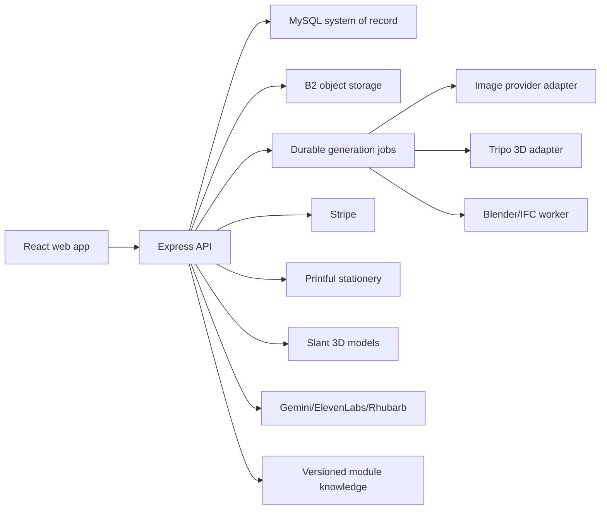
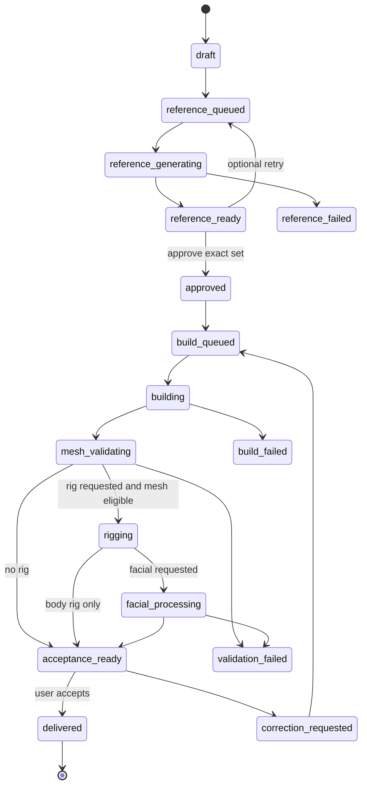

# Pawsome3D Unified Product Architecture

**Status:** Lead specification, implementation started 2026-07-22  
**Repository:** `robs46859-eng/pawsmemories`  
**Working branch at audit:** `fix/text-mode-reference-screen` at `4ef7e84`  
**Deployment baseline:** `origin/main` at `aea5a93` (not the audited working branch)  
**Owners:** Lead developer integrates; specialist agents own bounded, non-overlapping work sets.

## 1. Executive Decision

Pawsome3D will use one versioned asset platform for every generated or uploaded item. Text prompts, reference images, turnaround images, GLB models, rigs, facial blendshapes, accessories, stationery artwork, STL print derivatives, thumbnails, and validation reports are related derivatives of an immutable source asset. User-facing modules are product views over that asset graph rather than independent storage systems.

The platform must never describe a visual reference as a verified mesh. It will verify twice:

1. **Pre-build verification:** input quality, subject coverage, consistency across high-resolution views, rights/safety, declared real-world scale, intended output, and user approval.
2. **Post-build verification:** geometry, texture, dimensions, topology, printability, skeleton, skin weights, facial targets, file integrity, and rendered-view comparison.

The guided creation flow becomes:

`text/photo -> high-resolution reference set -> user approval or optional retry -> GLB build -> mesh validation -> optional rig/facial validation -> user acceptance -> Fur Bin -> digital/physical products`

“GLM” in product notes is interpreted as **GLB**, the binary glTF delivery format.[^glb]

## 2. Current Baseline and Immediate Risks

The audited branch passes TypeScript, 733 tests (732 pass, 1 skip), and the production build. The reported broken build is therefore not reproducible on this branch. The highest-probability causes are deployment of a different commit, a stale archive, or runtime database/schema failure.[^branch]

### 2.1 Release blockers

| Priority | Problem | Required correction |
|---|---|---|
| P0 | `initDb()` catches its outer error and lets the server start against a partial schema | Fail startup when a configured database cannot initialize; expose liveness and DB-backed readiness |
| P0 | Boot-time schema migration is a monolithic block in `db.ts` | Introduce ordered, recorded migrations; retain compatibility boot DDL only during transition |
| P0 | Marketplace checkout selects `title` although the table defines `name` | Align query and API response contract, with an integration test |
| P0 | Marketplace STL derivative insert omits required columns and writes a nonexistent column | Use a single repository function and delete uploaded objects on failed persistence |
| P0 | Wags checkout reads `users.stripe_customer_id`, but the column is not guaranteed | Add a migration and type; test a legacy schema upgrade |
| P0 | Uploaded 3D print files allow 25 MB in UI but hit a 1 MB parser | Move to direct/multipart upload or scope the existing 50 MB parser immediately |
| P1 | Client “printability” validation runs before a mesh exists | Rename it input preflight and add authoritative server-side post-build mesh validation |
| P1 | Fur Bin storage accounting omits many derivatives | Make asset registration and storage accounting atomic and universal |
| P1 | Guided create approves only one front image | Generate and approve a consistent high-resolution turnaround set |
| P1 | Facial support may only rename provider morphs | Report actual capability; do not promise a facial rig until morph and deformation tests pass |

## 3. Architecture Principles

1. **Immutable inputs, versioned derivatives.** Never overwrite the source used for a paid generation.
2. **Durable orchestration.** Long provider operations are jobs with attempts, leases, timeouts, idempotency keys, and terminal states.
3. **Approval is explicit and version-bound.** Approval records point to exact asset versions and prompt/config hashes.
4. **Billing follows reservation/commit/release.** Reserve credits before work; commit once; release on terminal provider failure.
5. **Honest capability labels.** “Riggable,” “facial,” “print-ready,” “scaled,” and “IFC” are validation results, not request options.
6. **One asset registry.** Every stored byte has an owner, purpose, hash, size, visibility, retention policy, and lineage.
7. **Ports around providers.** Gemini, Tripo, Blender, Printful, Slant 3D, Stripe, ElevenLabs, B2, and IFC tooling are adapters behind internal contracts.
8. **Fail closed for money and schema; degrade gracefully for optional media.**
9. **Observability is part of correctness.** Correlation IDs connect request, payment, job, asset, order, and provider events.
10. **Release provenance is visible.** Build artifacts include commit SHA, branch, build time, schema version, and checksum.

## 4. System Context

The initial deployment may keep the API and scheduler in one process, but domain modules must not depend on that topology. The target separates HTTP handling from workers so Hostinger process restarts do not strand builds.

## 5. Canonical Asset Model

### 5.1 Core entities

| Entity | Purpose | Key fields |
|---|---|---|
| `assets` | Logical user or catalog asset | UUID, owner, type, visibility, lifecycle, current_version_id |
| `asset_versions` | Immutable content version | asset_id, version, sha256, MIME, bytes, bucket/key, metadata JSON, source_version_id |
| `asset_relations` | Typed lineage graph | parent_version_id, child_version_id, relation (`turnaround`, `mesh`, `rig`, `stl`, `render`, `print_file`) |
| `generation_sessions` | User goal and configuration | subject type, input mode, intended uses, scale source, state, prompt/config hash |
| `approval_revisions` | Approval/retry history | session, asset set hash, decision, notes, actor, timestamp |
| `jobs` | Durable unit of work | type, state, lease, idempotency key, input/output manifests |
| `job_attempts` | Provider attempt history | provider, request ID, attempt, timing, normalized error |
| `validation_reports` | Machine/human evidence | stage, validator version, measured metrics, findings, pass/fail |
| `products` / `skus` | Sellable digital or physical configuration | fulfillment type, source asset constraints, price, currency |
| `orders` / `order_items` | Commercial intent and fulfillment | idempotency key, payment state, fulfillment state, provider IDs |
| `entitlements` | Download/subscription/access rights | owner, product, source, starts/ends, status |
| `subscriptions` / `packs` | Wags plan and monthly delivery | cadence, prepaid term, bonus policy, pack state |
| `outbox_events` | Transactional external side effects | topic, aggregate, payload, delivery attempts |

Existing tables remain readable while adapters migrate them to these contracts. No big-bang data rewrite is required.

### 5.2 Asset types

- `source_photo`, `source_prompt`, `reference_front`, `reference_left`, `reference_right`, `reference_back`, `reference_three_quarter`, `reference_top`
- `model_glb`, `model_lod`, `model_rigged_glb`, `model_facial_glb`, `model_ifc`, `model_stl`, `model_3mf`
- `accessory_glb`, `texture_set`, `material`, `turntable_video`, `thumbnail`
- `stationery_background`, `stationery_template`, `stationery_composite`, `stationery_print_file`
- `voice`, `animation_clip`, `validation_report`, `provider_manifest`

### 5.3 Storage rules

Every upload first receives a server-generated object key and content hash. Database registration and storage usage update are one logical operation. A compensating cleanup job removes an object when database registration fails. Private paid assets use short-lived signed URLs; public showcase assets use explicit publication records rather than making a user’s original object public.[^storage]

## 6. Create 3D Pet, Human, or Object

### 6.1 Inputs

The user chooses:

- Text or image input
- Animal, human, object, building shell, or BIM/IFC intent
- Digital display, animation, AR, stationery render, or 3D print target
- Optional real-world measurement and unit
- Optional rig, facial animation, accessories, and print preparation

The UI must explain that one photo can produce a plausible model but cannot prove hidden geometry. For identity-sensitive pets or people, request front, both sides, back, three-quarter, and distinguishing details. For scale-sensitive work, require at least one trusted measurement or calibrated capture.[^coverage]

### 6.2 Pre-build reference set

For text input, the image adapter creates a consistent character sheet. For photo input, it preserves identity while synthesizing missing views. Minimum approval set:

- front
- left profile
- right profile
- back
- front three-quarter

Images should be generated at the provider’s highest useful resolution, retained as immutable versions, and displayed with zoom. Consistency checks compare silhouette, markings, limb count, accessories, eye color, and subject proportions. A warning is preferable to silently “fixing” a real pet’s markings.

The user can:

- approve the set;
- request a retry with notes (optional, never forced);
- replace individual source photos;
- cancel before 3D credits are committed.

### 6.3 Session state machine

Automatic infrastructure retries are bounded and invisible unless they change price or output. User retry is a product decision and always creates a new revision.

### 6.4 3D build and outputs

The 3D provider consumes the approved multiview manifest, not only the front image. Output is normalized to meters, Y-up, +Z forward at delivery, with transform history preserved. GLB is canonical for web/AR delivery; STL or 3MF is a validated derivative for printing. Source provider metadata and license terms are retained.

Post-build renders use the same standard angles as the reference set. Visual comparison is advisory; geometry validation is authoritative for file integrity and printability.

### 6.5 Rig and facial contract

Species classification chooses biped, quadruped, or unsupported. Rig validation requires named bones, hierarchy, nonzero vertex weights, bounded influences, bind-pose integrity, and deformation smoke tests. Facial validation separately reports:

- actual morph target inventory;
- canonical viseme mapping coverage;
- blink/jaw/eye controls;
- deformation screenshots;
- unsupported facial capability.

Provider morph-name canonicalization is not facial mesh generation. If suitable facial geometry is absent, the product must offer body rig only or route to a dedicated facial authoring job.[^facial]

## 7. Verification Architecture

### 7.1 Pre-build report

Checks source availability, image decoding, minimum resolution, subject visibility, turnaround completeness, cross-view consistency, selected usage, trusted scale input, prompt safety, and approval hash. It may report print risk but cannot report mesh printability.

### 7.2 Post-build report

Checks:

- GLB parse and buffer/image integrity
- scene bounds, units, transforms, origin, up/forward axes
- triangle count, materials, texture resolution, UV presence
- connected components, duplicate/degenerate geometry, normals
- watertightness, non-manifold edges, self-intersections
- minimum wall thickness, minimum feature size, overhang/support estimate
- requested physical dimensions and tolerance
- skeleton/weights/animation and facial targets when requested
- rendered-view similarity and human review exceptions

Each result names the validator version and measured values. “Passed” is scoped: `display_ready`, `animation_ready`, `ar_ready`, `print_candidate`, or `manufacturing_approved`. Slant 3D/Printful can still reject a technically valid asset under their production rules.[^print]

## 8. Fur Bin Model Showcase

Fur Bin becomes the user’s asset library and optional showcase, not merely a union of unrelated tables.

### 8.1 Private library

- model versions and lineage
- approval and validation status
- GLB viewer, turntable, dimensions, rig/facial badges
- accessories, animations, voice, stationery, and print derivatives
- download/export rights and storage usage
- retry/correction history

### 8.2 Showcase publishing

Publication creates a separate showcase record with title, description, tags, category, cover render, visibility, attribution, moderation status, and selected public derivative. Unpublishing never deletes the private source. Marketplace listing is a separate commercial decision linked to a showcase item.

## 9. Accessories, Mesh, and Wardrobe

Procedural Three.js placeholders are acceptable only for preview. Production accessories need immutable GLBs, attachment profiles, compatible species/skeletons, scale ranges, collision bounds, license, preview images, and export policy. Fitting produces an accessory placement derivative; permanent mesh merge is optional and must preserve materials and rig weights.

Accessory validation includes penetration, floating distance, attachment bone availability, animation sweep, polygon budget, and print clearance. Physical print orders use a fused, revalidated mesh rather than assuming the viewport overlay exists in the exported GLB.

## 10. Digital and Physical Stationery

### 10.1 Template system

Templates are managed assets, not only layout metadata. Each template version contains:

- topic, holiday/event, locale, orientation, trim size, bleed, safe area
- background art at output resolution
- editable slots, font licenses, color profile, and accessibility metadata
- digital and print export presets
- preview render and moderation state

Digital exports support PNG/JPEG/PDF at a declared resolution. Physical exports are rendered server-side at product-specific DPI with bleed and safe-area validation. Browser previews are not treated as final print files.[^dpi]

### 10.2 Fulfillment

Printful receives a frozen print-file asset version, SKU, placement, and idempotency key only after payment confirmation. Provider webhooks and scheduled reconciliation converge on the same order state machine.

## 11. 3D Printing

The print pipeline consumes a post-build model version plus desired dimensions/material. Blender produces a print derivative, but the API owns job state and validation evidence. The supported export order is 3MF when color/material semantics matter, STL for broad compatibility, and GLB as the visual source.

```mermaid
flowchart LR
  A["Approved GLB"] --> B["Scale and accessory fusion"]
  B --> C["Repair and manifold checks"]
  C --> D["Wall/feature/support checks"]
  D --> E["STL or 3MF derivative"]
  E --> F["Quote"]
  F --> G["Payment"]
  G --> H["Slant 3D submission"]
  H --> I["Tracking and reconciliation"]
```

No upload to a fulfillment provider occurs before a durable local order exists. No charge is considered fulfilled before a provider order ID is stored.

## 12. Scaled Building and BIM

Image-to-building supports two deliberately different products:

- **Shell model:** image-informed visual exterior/interior shell, user-supplied dimensions, lower credit price, GLB/STL output, no semantic BIM claim.
- **IFC model:** semantic levels, walls, slabs, openings, doors/windows, spaces, materials, quantities, coordinate reference, and IFC4 export; higher credit price because it requires authoring and validation.

Pre-build verification checks image coverage and trusted dimensions. Post-build verification checks dimensions again, topology, element relationships, IFC schema, placement matrices, units, GlobalIds, and round-trip import. An image alone cannot establish concealed construction, exact dimensions, code compliance, or survey accuracy.[^bim]

## 13. Wardrobe Wags Subscription Packs

Wags supports monthly and annual prepaid plans. A monthly pack may include mini models, accessories, materials, stationery backgrounds, animations, and early-access items. The catalog item and the delivered entitlement are separate so later catalog edits cannot alter a delivered pack.

Annual advance-pay incentives are policy-driven SKUs, for example bonus credits, one exclusive model, discounted print preparation, or an extra pack. Bonus issuance is an idempotent ledger event keyed by subscription term, never a mutable boolean alone.

The subscription lifecycle covers checkout pending, active, past due, canceled-at-period-end, canceled, and expired. Stripe webhooks are authoritative but reconciliation repairs missing webhook delivery.

## 14. Randy 3D Assistant

Randy’s current procedural head is a temporary representation. The target is a validated, lightweight GLB with body/head rig, eyes, jaw, blink, and canonical visemes. It needs LODs and a 2D fallback for weak GPUs.

Knowledge must move out of one hardcoded prompt. A versioned module registry describes:

- module name and current capabilities;
- prerequisites and prices from server-owned sources;
- routes/actions the client permits;
- short guided tours;
- known limitations and support escalation.

At request time, Randy receives the relevant module entries plus live user context such as entitlement and job status. The model may propose only allowlisted actions; the server/client validates every action. Randy must never invent price, job completion, print readiness, or subscription status.[^chat]

## 15. Database Reliability and Migration Plan

### 15.1 Immediate lifecycle hardening

- Parse bounded pool settings from environment.
- Enable TCP keepalive and set connection/idle timeouts appropriate to Hostinger.
- Add a cheap `SELECT 1` readiness probe with latency and normalized error.
- Add `closePool()` and graceful SIGTERM/SIGINT shutdown.
- Fail startup if a configured database cannot initialize.
- Keep `/healthz` process-only and `/readyz` dependency-aware.
- Stop swallowing required migration errors.

### 15.2 Migration architecture

Create `schema_migrations(version, name, checksum, applied_at, duration_ms)`. Each migration is an ordered file/function, transaction-wrapped where MySQL permits, idempotent only by recorded version, and tested against both empty and representative legacy schemas. DDL that auto-commits requires explicit forward-recovery steps.[^mysql-ddl]

App startup verifies the required schema version; production migration runs as an explicit deployment step. During transition, boot may apply only a narrowly documented compatibility set.

### 15.3 Query and transaction rules

- Repositories own SQL; route handlers do not embed schema knowledge.
- Money, credits, entitlements, and orders use transactions and row locks where needed.
- Retry transient reads and idempotent statements only; never blindly replay a multi-step payment transaction.[^retry]
- Provider calls occur outside DB transactions, coordinated through the outbox/job state.
- Unique keys enforce idempotency for Stripe events, checkout sessions, jobs, packs, and fulfillment submission.

### 15.4 Dangerous utilities

`clear-db.ts` must require an explicit non-production environment, typed confirmation token, backup reference, and narrow scope, or be removed from deploy archives. It must never share credentials with production startup.

## 16. Internal API Boundaries

| Boundary | Responsibilities |
|---|---|
| `/api/generation-sessions` | create/read session, upload sources, reference generation, approval/retry, build request |
| `/api/jobs` | status, events, safe retry/cancel |
| `/api/assets` | metadata, lineage, signed access, versions, publication |
| `/api/validation-reports` | scoped evidence and findings |
| `/api/fur-bin` | composed library view and showcase publishing |
| `/api/accessories` | catalog, compatibility, fit jobs, entitlements |
| `/api/stationery` | templates, compositions, digital export, print preparation |
| `/api/print-orders` | quote, checkout, submission, tracking |
| `/api/subscriptions/wags` | plans, checkout, packs, entitlements, cancellation |
| `/api/randy` | chat, module knowledge, allowlisted actions, tours |

Existing routes remain behind compatibility adapters until client migration. Zod schemas define external request/response contracts and are shared only where they do not expose server-only fields.

## 17. Security, Privacy, and Rights

- Uploaded photos and private models default to private storage.
- Public showcase requires explicit consent for a selected derivative.
- Remove EXIF location unless the user explicitly needs geospatial/BIM data.
- Scan file signatures and parse limits; do not trust extensions or client MIME.
- Enforce ownership at repository/service boundaries, not only routes.
- Keep provider secrets server-side and redact them from manifests/logs.
- Record image/model provider terms, licenses, and commercial-use eligibility.
- Rate-limit expensive generation and signed download endpoints.
- Treat prompts, filenames, IFC properties, and marketplace text as untrusted content.

## 18. Observability and Operations

Every response includes a request ID. Jobs, assets, orders, and provider calls carry it forward. Structured events include durations, provider IDs, attempt numbers, output hashes, and normalized failure categories without personal media or secrets.

Required dashboards/alerts:

- DB pool wait, connection failures, readiness failures, migration version
- job queue age, attempt rate, provider latency/failure
- reserved versus committed/released credits
- uploaded but unregistered objects and storage-accounting drift
- paid but unsubmitted print orders
- Stripe webhook lag and reconciliation corrections
- build SHA mismatch between archive, server, and client

## 19. Build and Deployment

The release pipeline is:

1. verify clean intended branch and compare with `origin/main`;
2. install from lockfile on supported Node version;
3. typecheck, lint, unit/integration tests, production build;
4. run migration validation and archive smoke test;
5. produce manifest with commit SHA, schema version, checksums, Node/npm versions;
6. create deployment ZIP from the manifest allowlist;
7. deploy, migrate, start, and check `/healthz`, `/readyz`, and a version endpoint;
8. execute authenticated smoke tests for create status, Fur Bin, checkout preflight, and Randy.

A green branch build does not approve a ZIP built from another commit.[^archive]

## 20. Phased Implementation

### Phase 0: Stabilize database and release provenance

**Scope:** pool lifecycle, fail-fast initialization, readiness/liveness, graceful shutdown, explicit build version, migration ledger scaffold, and repair the three proven schema-contract defects.  
**Exit:** legacy and empty-schema migration tests pass; readiness fails when DB fails; marketplace checkout and derivative persistence tests pass; Wags customer column is guaranteed; build archive identifies its commit.

### Phase 1: Canonical asset registry and storage accounting

**Scope:** asset/version/relation tables, registration service, hashes, signed access, compensation cleanup, migrate Fur Bin reads.  
**Exit:** every newly generated/uploaded byte is registered and counted; reconciliation reports zero unexplained drift.

### Phase 2: High-resolution multiview approval

**Scope:** merge the older turnaround capability into guided create, approval revisions, optional retry, zoom UI, consistency report, credit reservation.  
**Exit:** a user can create from text or photos, approve at least five immutable views, retry optionally, and no 3D build starts against an unapproved hash.

### Phase 3: Durable 3D build and dual verification

**Scope:** durable jobs/attempts, multiview Tripo input, post-build GLB validation, standard renders, correction loop, delivery.  
**Exit:** provider restart/retry is idempotent; every delivered model has pre- and post-build reports; credits reconcile under success/failure.

### Phase 4: Rigging, facial mesh, accessories

**Scope:** species profiles, body rig tests, actual facial authoring fallback, attachment profiles, fitted export, animation sweep.  
**Exit:** badges reflect measured capability; unsupported faces degrade honestly; accessories appear in exported and print derivatives.

### Phase 5: Fur Bin showcase and marketplace

**Scope:** asset-centric library, versions, public showcase, marketplace link, storage lifecycle, moderation.  
**Exit:** publish/unpublish never leaks source media; purchases use immutable deliverables; current SQL defects are covered by integration tests.

### Phase 6: Stationery and physical fulfillment

**Scope:** high-resolution seasonal/event template library, server rendering, Printful products, Slant 3D pipeline, reconciliation.  
**Exit:** digital output and provider print files pass dimension/DPI/bleed tests; paid orders converge after webhook loss.

### Phase 7: Wags product subscription

**Scope:** customer checkout, monthly packs, mini models/accessories, annual incentives, entitlement delivery and recovery.  
**Exit:** monthly and annual test clocks issue exactly one pack/bonus per entitlement period.

### Phase 8: Randy assistant and product guidance

**Scope:** production 3D Randy asset, LOD/fallback, module registry, live user context, allowlisted navigation/actions, tours.  
**Exit:** Randy answers module/pricing/status questions from authoritative data and cannot execute an unapproved action.

### Phase 9: Scaled shell and IFC BIM

**Scope:** calibrated input, shell/IFC price tiers, semantic authoring, IFC4 export, round-trip and measurement reports.  
**Exit:** shell and IFC claims are distinct; both verify scale before and after; IFC fixture round-trips without unit or placement loss.

## 21. Subagent Operating Plan

The lead developer retains architecture, database contracts, integration, release decisions, and conflict resolution. Subagents receive bounded scopes and must not edit overlapping files concurrently.

| Phase | Subagent | Required skill/context | Write boundary | Deliverable |
|---|---|---|---|---|
| 0 | DB Reliability Agent | MySQL/mysql2, `DEPLOYMENT_NOTES.md` | migrations, DB lifecycle tests | pool/migration/readiness patch and failure tests |
| 0 | Commerce Contract Agent | Stripe idempotency, schema map | marketplace/Wags repositories and tests only | repaired SQL and compensation tests |
| 1 | Asset Registry Agent | object-storage semantics | asset service, migrations, focused tests | versioned registration and reconciliation |
| 2-3 | 3D Pipeline Agent | **`image-to-3d` skill**, provider contracts | generation domain and create-flow tests | multiview manifests, approvals, durable states |
| 3 | Verification Agent | glTF Transform, Blender mesh analysis | validators/fixtures/tests only | scoped validation reports |
| 4 | Animation Agent | `skills/animator/RIGGING.md`, `MESHOPS.md`, `LIPSYNC.md` | animator/worker modules | rig/facial/accessory evidence |
| 5 | Fur Bin Agent | existing visual language | Fur Bin/showcase components and APIs | asset-centric showcase UX |
| 6 | Print Agent | Printful/Slant specs and PDF/image QA | stationery/fulfillment modules | print templates, output and recovery tests |
| 7 | Subscription Agent | Stripe subscriptions/entitlements | Wags domain only | packs, advance-pay incentives, time tests |
| 8 | Randy Agent | 3D web rendering, module registry | Randy components and knowledge APIs | 3D asset integration and grounded guidance |
| 9 | BIM Agent | scaled model + IFC/IfcOpenShell skills | BIM domain/worker/tests | shell/IFC tiers and round-trip gates |
| all | Adversarial Review Agent | no implementation ownership | read-only | severity-ranked findings before merge |

Agents must report changed files, test commands, unresolved risks, and assumptions. The lead reviews diffs and reruns global gates. Use parallel agents only when write sets are disjoint.

## 22. Skills, Tools, and Durable Memory

### 22.1 Skills

- **Image-to-3D:** `/Users/robert/.codex/skills/image-to-3d/SKILL.md` for capture coverage, deliverable selection, and verification language.
- **Animator rigging:** `skills/animator/RIGGING.md`.
- **Animator mesh operations:** `skills/animator/MESHOPS.md`.
- **Animator lip sync:** `skills/animator/LIPSYNC.md`.
- **Repository instructions:** nearest applicable `AGENTS.md`; currently reviewed material under `NEED_REVIEW` is not automatically authoritative.
- BIM/IFC work must restore or add reviewed project skills before delegation if the earlier skill documents remain relocated.

### 22.2 Tools by concern

| Concern | Tools/adapters |
|---|---|
| Reference generation | existing image provider adapter; high-resolution multiview manifests |
| 3D generation | Tripo adapter with provider task IDs and webhooks/polling |
| Geometry | Blender worker, glTF Transform, meshoptimizer where appropriate |
| BIM | IfcOpenShell worker and IFC fixtures |
| Voice/face | ElevenLabs, Rhubarb, Three.js morph/animation validation |
| Storage | Backblaze B2 public/private adapters and signed URLs |
| Billing | Stripe Checkout, subscriptions, webhook ledger, reconciliation |
| Fulfillment | Printful and Slant 3D adapters |
| Validation | Node test, TypeScript, lint, Vite/esbuild, fixture renders |

### 22.3 Durable project memory

Hidden conversational memory is never a source of truth. Each phase updates:

- this architecture specification for approved decisions;
- `PHASED_IMPLEMENTATION.md` for phase status and evidence;
- `handoff.md` for current branch/SHA, active risks, exact next step, and commands;
- versioned Zod/API schemas for contracts;
- migration ledger for database state;
- provider manifests and validation reports for asset provenance;
- module registry for Randy’s knowledge;
- ADRs for decisions that change data ownership, billing, or providers.

Each phase starts by reading these sources and ends by recording evidence. Agent summaries alone are not acceptance evidence.

## 23. Test and Review Gates

| Gate | Minimum evidence |
|---|---|
| Database | empty + legacy migration, disconnect/reconnect, readiness failure, graceful close |
| Billing | duplicate webhook/checkout, provider timeout, reservation release, no double charge |
| Asset | hash/lineage, authorization, signed expiry, failed-registration cleanup, storage reconciliation |
| Image approval | view completeness, immutable approval hash, optional retry, cancellation |
| GLB | parse, buffers, textures, bounds, transforms, standard renders |
| Rig/facial | bone/weight tests, deformation sweep, actual morph coverage, unsupported fallback |
| Print | manifold/thickness/scale report, upload limits, frozen derivative, duplicate submission |
| Stationery | pixel dimensions, DPI metadata, bleed/safe zone, provider placement |
| Subscription | monthly/annual clocks, duplicate invoice, bonus once, cancellation |
| Randy | authoritative prices/status, prompt injection, action allowlist, fallback rendering |
| Release | clean intended SHA, full gates, archive smoke test, health/readiness/version |

Human review is required for identity fidelity, generated-image consistency, accessory fit, facial quality, stationery aesthetics, and physical sample approval. Automated tests cannot replace those judgments.

## 24. First Implementation Slice

Implementation begins with Phase 0 in this order:

1. Add bounded pool configuration, health check, and close lifecycle.
2. Stop successful startup after required DB initialization failure.
3. Add liveness/readiness/version endpoints and graceful shutdown.
4. Guarantee `users.stripe_customer_id` in the compatibility migration.
5. Repair marketplace listing and derivative SQL contracts with tests.
6. Raise or replace the 3D print upload parser boundary.
7. Record the initial migration-ledger design without attempting a risky one-shot extraction of all boot DDL.

## Footnotes: Problematic Coding to Watch

[^glb]: GLM usually names a mathematics library or generic model notation. The browser delivery artifact in this repository is GLB. Do not add a new `.glm` format by accident.
[^branch]: The audited working branch and `origin/main` differ. Never infer deployment health from tests on a commit that was not packaged. Embed and expose the SHA.
[^storage]: Upload-first flows can orphan objects; DB-first flows can point to missing objects. Use a staged object plus finalize/compensation pattern and a reconciliation job.
[^coverage]: Generated missing views are hypotheses, not recovered photographic truth. Preserve which views are observed versus synthesized.
[^facial]: A morph target with a familiar name may still deform the wrong vertices. Validate displacement, affected region, and representative renders, not names alone.
[^print]: Watertightness is necessary but insufficient. Material/process-specific thickness, supports, orientation, trapped volumes, and provider rules remain.
[^bim]: Perspective photos do not yield survey-grade dimensions. IFC semantics inferred from images require confidence and human confirmation; concealed systems must not be invented as fact.
[^dpi]: DPI metadata alone does not create resolution. Validate physical size against pixel dimensions and the provider’s bleed template.
[^chat]: Retrieval content is untrusted data. It cannot grant new actions or override the system/action allowlist.
[^mysql-ddl]: Many MySQL DDL statements auto-commit, so a transaction does not make a long migration atomic. Prefer small forward-only migrations with recorded checkpoints.
[^retry]: Retrying after an unknown provider result can duplicate orders or charges. Query by the original idempotency key/provider request ID before creating another operation.
[^archive]: ZIP creation must use an allowlist and smoke-test the extracted archive. Packaging an existing `dist` directory can silently combine new server code with old client assets.
