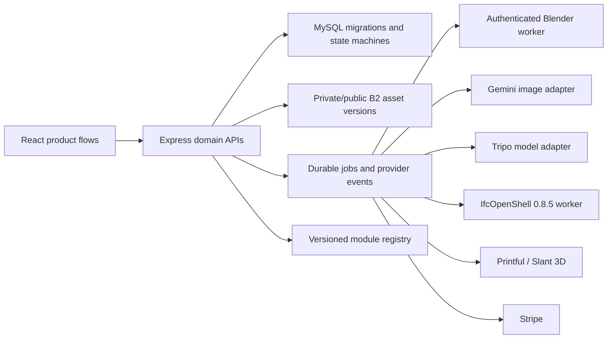

# Pawsome3D Phase 4-9 Completion Architecture

**Status:** Controlling implementation and release-gate specification
**Date:** 2026-07-22  
**Baseline:** `9a7c692` on `fix/text-mode-reference-screen`  
**Supersedes:** Agent completion claims for Phases 4-9; existing evidence remains historical  
**Related:** `PAWSOME3D_PLATFORM_ARCHITECTURE_SPEC.md`, `BUILD_EXECUTION_SCAFFOLD.md`, `PHASED_IMPLEMENTATION.md`

## 1. Executive Decision

Phase 4 now has an authenticated Blender worker for body rigging, semantic facial authoring, measured deformation, and optional fused-print derivatives. The implementation rejects unsupported or unmeasured results instead of restoring the earlier fabricated success data. It remains dark-launched until the representative Render fixture corpus and human animation/print review pass.

Phases 5-9 now have default-off domain code through schema 29. Local code completion is not production approval: provider sandboxes, accepted assets, live storage/worker evidence, responsive browser review, and the human release gate listed below remain mandatory.

The completed product flow is:

```text
approved multiview references
  -> accepted and validated GLB
  -> optional body rig
  -> optional facial authoring and measured deformation
  -> optional accessory fit and fused print derivative
  -> explicit acceptance of an immutable manifest
  -> private Fur Bin version
  -> optional public derivative / marketplace deliverable
  -> stationery, physical print, Wags pack, Randy guidance, or scaled BIM workflows
```

All work remains dark-launched until its phase gate passes. A feature flag is not evidence that a feature works.

## 2. Non-Negotiable Product Truth

1. A named morph target is not proof of a facial rig.[^morph-name]
2. A body skeleton is not proof that animation deformation is usable.
3. A viewport accessory is not present in a downloaded or printed model unless an exported derivative proves it.
4. A private source is never the public showcase object.
5. A browser preview is never the stationery print master.
6. A subscription webhook is not an entitlement until the idempotent delivery transaction commits.
7. A chatbot response can propose an action but cannot execute a financial, destructive, or privileged action.
8. An image-derived building is not survey-grade. Both Shell and IFC require explicit calibration and before/after dimensional reports.[^image-scale]
9. Every paid or publishable output is an immutable canonical asset version with hash, byte count, owner, visibility, rights, and lineage.

## 3. Target System Boundaries



The API owns identity, authorization, billing, job state, retry policy, storage keys, and acceptance. The Blender worker owns deterministic geometry operations and measurements. It never decides ownership, price, publication, or entitlement.

## 4. Phase 4: Body Rig, Facial Rig, and Accessories

### 4.1 Worker request contract

The API submits an authenticated request containing:

- stable job and attempt UUIDs;
- a short-lived owner-authorized source URL plus expected SHA-256 and byte limit;
- selected versioned rig profile (`biped.standard`, `quadruped.dog.medium`, or another reviewed profile);
- measured source bounds, triangle count, and subject classification;
- `requestFacial`, requested canonical facial set, and selected accessories;
- output budgets and validator version;
- an idempotency key and callback/poll token that cannot be used for another attempt.

The worker must reject redirects to unapproved origins, mismatched hashes, non-GLB signatures, oversized bodies, unknown profile versions, and expired requests.[^ssrf]

### 4.2 Body-rig pipeline

1. Import the exact accepted GLB into an empty Blender scene.
2. Preserve source transforms and record the normalization transform.
3. Select a profile only from the API-provided classification and profile ID.
4. Use existing valid skeleton/weights when they satisfy the canonical contract; otherwise author a profile skeleton and automatic weights.
5. Enforce required bones, parent hierarchy, unique names, finite inverse bind matrices, bounded influences, and nonzero weighted coverage.
6. Run bind-pose, locomotion, extreme-pose, tail/ear, jaw, and silhouette sweeps where supported.
7. Export a fresh GLB and reopen it for independent inspection.

Unsupported topology returns a typed failure or `body_only`; it never receives an animation-ready badge.

### 4.3 Facial authoring contract

Facial work has two routes:

- **Inventory route:** retain authored source morphs only when measured deformation proves they are nonempty, localized, finite, and reversible. Canonicalize aliases without renaming or deleting source targets.
- **Authoring route:** when usable facial geometry exists but canonical targets are missing, create shape keys for `viseme_A` through `viseme_H`, `viseme_X`, `jawOpen`, left/right blink, and optional eye controls. Authoring is permitted only after the worker identifies a credible head/face region and enough vertices for localized deformation.

The authoring route must record the algorithm version and assumptions. If face-region localization, eye localization, mouth localization, or mesh density is insufficient, the output is body-only. Coordinate-only guesses against an arbitrary mesh are forbidden.[^facial-locality]

### 4.4 Facial verification

Each reported target must pass:

- nonzero displaced-vertex count and finite deltas;
- affected-region locality for mouth, jaw, or eye as appropriate;
- bounded maximum displacement relative to head size;
- left/right symmetry or intentional asymmetry checks;
- neutral restoration with no cumulative deformation;
- representative rendered evidence from front and three-quarter views;
- canonical viseme coverage calculation from targets that passed deformation checks;
- exported GLB reopen with morph names and weights intact.

`full` requires all nine canonical visemes plus jaw and bilateral blink. `partial` requires measured usable targets but not full coverage. `body_only` is a valid product result. `unsupported` means the model cannot be safely animated.

### 4.5 Worker result contract

The worker returns a strict bounded manifest, not a loose success boolean:

```json
{
  "contractVersion": 1,
  "jobUuid": "...",
  "attemptUuid": "...",
  "sourceSha256": "...",
  "output": { "glbBase64": "...", "sha256": "...", "sizeBytes": 0 },
  "rig": { "metrics": {}, "rules": [], "overallPass": false },
  "facial": { "capability": "body_only", "targets": [], "rules": [] },
  "renders": [],
  "accessories": [],
  "warnings": []
}
```

The API independently verifies hashes and reopens the GLB before registering outputs. The worker cannot mark the database job accepted.

### 4.6 Durable API orchestration

- Provider calls occur outside database transactions.
- Attempts use a claimed lease, heartbeat, expiry, bounded retry count, and stable provider task identity.
- Worker results are recorded once by attempt UUID and source hash.
- Canonical asset registration, lineage, manifest persistence, and storage accounting commit together where possible; compensating cleanup removes unregistered objects.
- A retry reuses an existing provider result when its idempotency key is already known.
- Explicit user acceptance requires the exact server manifest hash and current output version.

### 4.7 Accessories

Accessory fit requests consume canonical accessory versions and measured attachment profiles. The worker returns attachment transform, penetration, floating distance, animation sweep, polygon budget, and print clearance. Display export and fused-print export are separate derivatives with separate validation.

### 4.8 Phase 4 exit gate

- biped, quadruped, body-only, malformed, multi-mesh, sparse-face, tail/ear, and accessory fixtures;
- authenticated worker and SSRF/hash/size rejection tests;
- GLB reopen proves skeleton, weights, animations, and facial targets survive export;
- no accepted job without canonical output plus all-pass manifest;
- retry/restart does not duplicate an output or charge;
- live Render Blender fixture evidence and mobile/browser review;
- `RIG_PIPELINE_V4_ENABLED` stays false until all of the above pass.

## 5. Phase 5: Fur Bin Library and Showcase

### 5.1 Private library

The new Fur Bin UI consumes only `/api/fur-bin`. It displays canonical versions, lineage, measured dimensions, scoped validation badges, rights, storage, signed previews, retry history, and available derivatives. Badges are derived from validation manifests; the client never submits them.

Required functions are search, tags, collections, version history, rollback, archive, download, retry, publish, unpublish, and signed-URL refresh. Mobile panels keep 20-24px gutters plus safe-area insets.

### 5.2 Public showcase

Publishing creates or selects a separate `public`/`published` derivative and immutable version. Moderation is database-admin-only. Public reads return only approved, currently published records. Unpublish removes public availability without deleting the private source.

Marketplace purchases bind to an immutable deliverable version, not `current_version_id`.

### 5.3 Phase 5 exit gate

- guessed UUID and cross-owner tests for every read/write route;
- public/private storage expiry and unpublish tests;
- concurrent publish, rollback, archive, and moderation tests;
- complete responsive private-library and public-showcase UI;
- immutable marketplace deliverable tests;
- `FUR_BIN_V5_ENABLED` stays false until the browser and storage gates pass.

## 6. Phase 6: Stationery and Physical Fulfillment

Templates are canonical versioned assets with event/topic, locale, trim size, bleed, safe area, pixel dimensions, DPI, color profile, licensed fonts, editable slots, and digital/print presets.

Server rendering produces a frozen digital PNG/JPEG/PDF or provider-specific print master. Validation recomputes physical dimensions from pixels and DPI and checks bleed, safe zones, text overflow, and asset rights. Printful and Slant requests use durable idempotency keys and reconciliation so webhook loss cannot strand a paid order.

Exit requires template stress fixtures, exact dimension/DPI tests, provider sandbox evidence, refund/reconciliation tests, and physical sample approval where authorized.

## 7. Phase 7: Wags Subscription Packs

Plans and Stripe prices map to versioned entitlements. Monthly packs contain immutable mini-model, accessory, and printable versions. Delivery uses a unique `(subscription, entitlement_period, pack_version)` identity and commits grants exactly once. Prepaid incentives are explicit products, not ad hoc bonus code.

Exit requires duplicate/out-of-order webhook replay, concurrent delivery, failed-payment recovery, cancellation/proration, annual bonus-once, owned-item substitution, and full entitlement audit tests.

## 8. Phase 8: Randy Product Assistant

The grounding and action-security foundation may remain enabled, but the 3D character is incomplete until a canonical Randy GLB version has measured body/facial capability, LODs, mobile budgets, and accessible static fallback.

Randy reads the versioned module registry plus live user context. Retrieval text is untrusted. Actions remain allowlisted proposals requiring a separate user click; no model output directly mutates money, jobs, assets, publication, orders, or admin state.

Exit requires accepted Randy GLB/LOD artifacts, blink/jaw/viseme evidence, weak-GPU fallback, keyboard/screen-reader fallback, stale-registry detection, prompt-injection tests, and a complete module walkthrough corpus.

## 9. Phase 9: Calibrated Shell and IFC BIM

The existing pre/post verification becomes a durable, idempotent build domain using private asset versions and a credit-event/refund ledger.

- **Shell:** lower price, calibrated visual GLB, no BIM semantics claim.
- **IFC:** higher price, IFC4 semantic model plus semantic GLB, units, hierarchy, unique GlobalIds, property sets, opening/fill relationships, finite placements, optional CRS label, and reopen verification.

Both lanes require a user-reviewed proposal, trusted calibration, pre-build report before charging, post-build dimensional report, immutable output versions, and truthful refund status. A CRS label never implies surveyed coordinates.

Exit requires real text and multi-image fixtures, shell and IFC downloads, Render IfcOpenShell tests, rotated/unit/two-room fixtures, durable retry/refund tests, and the full light/dark mobile browser matrix. Both BIM v2 flags stay false until then.

## 10. Database and Migration Allocation

Current schema version is 29. Migrations are forward-only:

| Version | Owner | Purpose |
|---|---|---|
| 25 | Phase 4 | Attempt UUID/provider identity, worker events, immutable rig attempt artifacts, render evidence, retry/lease recovery fields, and canonical output constraints |
| 26 | Phase 5 | Derived badge lineage, archive history, public cover/deliverable constraints, and collection maintenance |
| 27 | Phase 6 | Versioned stationery templates, render jobs, frozen print files, provider order events, and reconciliation |
| 28 | Phase 7 | Versioned Wags packs, entitlement periods, exactly-once grants, substitutions, and prepaid bonuses |
| 29 | Phase 9 | Durable BIM jobs/attempts/reports/acceptances, canonical private outputs, credit events, and refund reconciliation |

Migration 25 is integrated by the lead before later migrations. Parallel agents may propose but must not edit `server/migrations/runner.ts` concurrently.

## 11. API and State Contracts

Every new external payload is strict Zod. Unknown keys are rejected on paid and privileged endpoints. Public DTOs expose UUIDs and version numbers, never internal object keys or numeric authorization handles.

Long-running states follow:

```text
draft -> queued -> submitted -> processing -> validating -> ready -> accepted
                                            -> failed_retryable
                                            -> failed_terminal
                                            -> cancelled
```

Retries create attempts, not replacement jobs. Acceptance is append-only and version-bound. Cancellation cannot race a completed provider result into a refund plus accepted output.

## 12. Storage, Security, and Observability

- Worker authentication uses `WORKER_SHARED_SECRET` with constant-time comparison and HTTPS in production.
- The API mints every object key and short-lived download URL.
- Worker URL downloads enforce protocol, allowlisted host, redirect policy, byte limit, content signature, expected hash, and timeout.
- Logs contain job UUID, attempt UUID, duration, rule IDs, and normalized errors, but no source URLs, base64 media, secrets, prompts containing private data, or raw model/IFC properties.
- Metrics cover lease age, retry rate, worker failures, output cleanup, credit disposition, public/private storage drift, fulfillment lag, and entitlement duplicates.

## 13. Parallel Implementation Lanes

The lead owns this architecture, migration registry, cross-lane contracts, integration, final status, and release decisions.

| Lane | Agent role and skills | Exclusive write set | Deliverable |
|---|---|---|---|
| A | Rig Technician + Lip-Sync Director; `skills/animator/RIGGING.md`, `LIPSYNC.md`, `MESHOPS.md` | `blender-worker/rig_pipeline/**`, bounded additions to `blender-worker/server.js`, worker-only tests | authenticated rig/facial worker, strict measured manifest, fixtures |
| B | Fur Bin Product Engineer | `src/components/fur-bin-v5/**`, Fur Bin-only styles/tests; no `src/api.ts` | complete private/showcase UI against a provided client interface |
| C | Print and Subscription Engineer | new `server/stationery-v2/**`, `server/wags-v2/**`, focused tests; no migration registry or `server.ts` | strict template/render and entitlement domain services with deterministic tests |
| D | Randy/BIM Completion Engineer | `server/randy/**`, `server/bim/**`, `src/components/BimModelBuilder.tsx`, focused tests; no migration registry or `server.ts` | remaining non-storage Randy/BIM hardening and fixtures |
| Lead | Integration engineer | `server/migrations/runner.ts`, `server/rig-pipeline/**`, `server/fur-bin/**`, `server.ts`, `src/api.ts`, shared types/docs | durable orchestration, canonical storage, migrations, integration, global gates |
| Review | Adversarial reviewer, read-only | none | severity-ranked findings against this document |

Agents must not commit, push, edit another lane, enable flags, or claim external evidence. Each returns changed files, exact test results, assumptions, and unresolved external gates.

## 14. Skills, Tools, and Durable Memory

Required skills and local guidance:

- `/Users/robert/.codex/skills/image-to-3d/SKILL.md` for capture, hidden-geometry, output, and verification honesty;
- `skills/animator/RIGGING.md` for skeleton and deformation requirements;
- `skills/animator/LIPSYNC.md` for canonical A-H/X visemes and audio behavior;
- `skills/animator/MESHOPS.md` for GLB/LOD/export budgets;
- `NEED_REVIEW/AGENTS.md` for scaled/BIM invariants until it is restored to a reviewed root location;
- `.agents/skills/scaled-model-engineering`, `.agents/skills/bim-ifc-integration`, and `.agents/skills/geospatial-model-context` for Phase 9.

Tools/adapters are Blender, glTF Transform, Three.js, Node test, MySQL 8, B2 signed storage, Stripe, Printful, Slant 3D, Gemini, Tripo, IfcOpenShell 0.8.5, and NumPy 2.2.1. No new browser IFC library is added without a measured need.

Durable project memory is this document, `PHASED_IMPLEMENTATION.md`, `handoff.md`, phase evidence, strict schemas, migrations, canonical manifests, and validation reports. An agent summary is not durable evidence.

## 15. Integration and Release Gates

For each integration checkpoint:

1. Review all diffs against file ownership and this architecture.
2. Run focused unit, adversarial, migration, worker, and storage tests with zero phase-specific skips.
3. Run TypeScript, the complete Node suite under Node 24.18, IFC tests in the pinned worker, production build, and animator doctor.
4. Run light/dark browser checks at 320, 360, 390, 430px and desktop for changed product routes.
5. Keep incomplete flags false and record external gates honestly.
6. Update phase evidence and handoff with exact counts and remaining blockers.
7. Commit the reviewed tree, then build the deployment archive from that exact clean commit.

## 16. Immediate Critical Path

1. Keep all Phase 2-9 rollout flags false for the baseline deployment.
2. Run the body/facial/accessory fixture corpus against the deployed Render worker and inspect animation and fused-print output.
3. Run the Fur Bin private/public storage and responsive browser matrix.
4. Supply and approve Stationery shipping/provider adapters and provider sandbox evidence before enabling Phase 6.
5. Run Wags Stripe sandbox replay, cancellation, payment-recovery, and entitlement audits before enabling Phase 7.
6. Approve a canonical Randy GLB/LOD and accessible fallback before declaring Phase 8 complete.
7. Connect the durable BIM API to an authoritative accepted-model snapshot and a real Shell worker; then run the Render IFC and browser acceptance matrices.
8. Enable one flag at a time only after the corresponding human approval is recorded.

## Footnotes: Problematic Coding to Watch

[^morph-name]: Existing code already maps provider aliases. Alias mapping is useful for playback but proves nothing about vertex displacement. A target must survive export and pass measured deformation.
[^image-scale]: Perspective, focal length, lens distortion, occlusion, and synthesized views make image-only dimensions uncertain. Require one trusted measurement and publish tolerance/confidence.
[^ssrf]: A signed input URL is still untrusted at the worker. Validate resolved hosts and redirects, and compare the downloaded bytes to the API-provided hash before Blender opens them.
[^facial-locality]: Generic coordinate heuristics can move a chest, collar, or fur tuft instead of a mouth. Face authoring must use a credible head component plus localized geometry evidence and must degrade to body-only when uncertain.
[^leases]: MySQL DDL autocommits and worker calls outlive HTTP requests. Keep provider calls outside transactions, make every DDL statement forward-recoverable, and recover expired leases by stable attempt identity.
[^billing]: Never report “credits returned” unless the durable refund event committed. Unknown provider outcomes require reconciliation by idempotency key before retrying.
[^archive]: Generated `dist` content and ZIP files must come from the exact clean release commit. Never package a stale build directory.
